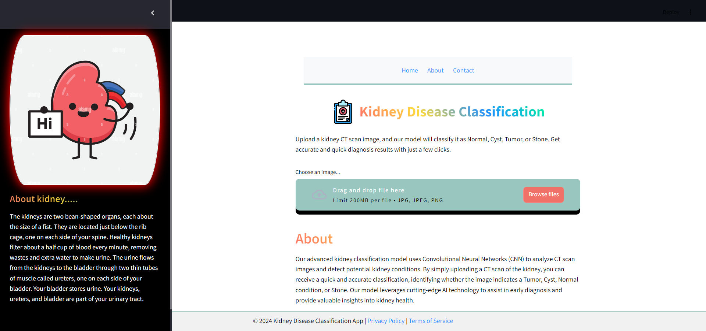
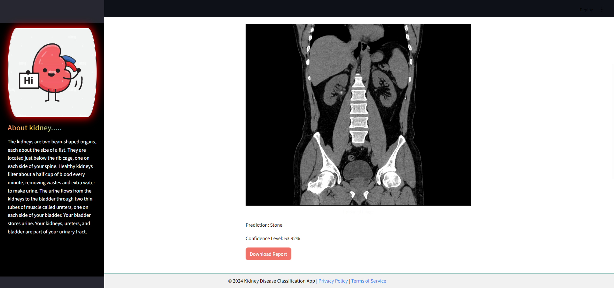
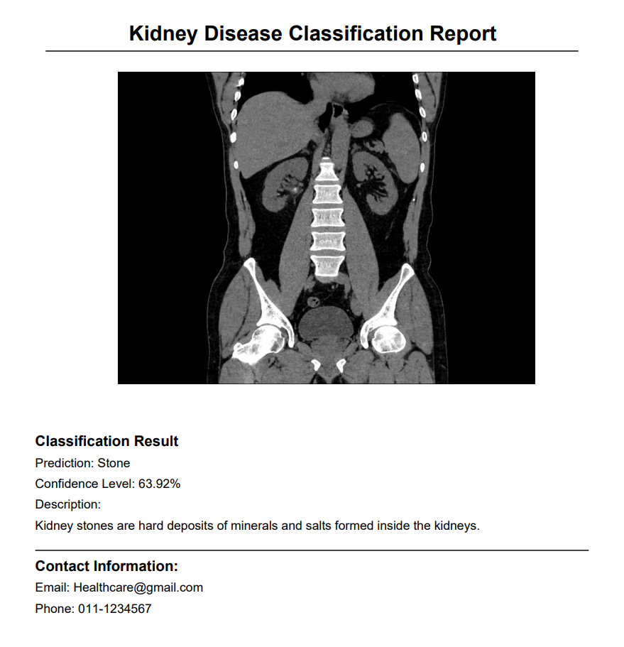

# 🩺 Kidney Disease Classification using CNN (VGG16)

 <!-- Replace with your banner image if available -->

## 📚 Table of Contents
- [Project Overview](#project-overview)
- [Features](#features)
- [Tech Stack](#tech-stack)
- [Setup and Installation](#setup-and-installation)
- [Usage](#usage)
- [Model Details](#model-details)
- [Streamlit App](#streamlit-app)
- [Docker](#docker)
- [Results](#results)
- [Contributing](#contributing)
- [License](#license)
- [Contact](#contact)

## 🌟 Project Overview

This project aims to classify kidney CT scan images into four categories: **Cyst, Normal, Stone, and Tumor** using a Convolutional Neural Network (CNN). The model is deployed as an interactive web application using **Streamlit**.

## ✨ Features
- **CNN-based Classification**: A deep learning model that classifies CT scan images.
- **Streamlit Web Application**: User-friendly web interface for uploading images and viewing predictions.
- **Dockerized Application**: Easily deployable with Docker.
- **PDF Report Generation**: Automatically generates a detailed report of predictions.

## 🛠 Tech Stack
- **Python**: Core programming language.
- **TensorFlow**: Used for building and training the CNN model.
- **Streamlit**: For building the interactive web app.
- **Docker**: Containerization for easy deployment.
- **ReportLab**: PDF report generation.

## 🚀 Setup and Installation

### Prerequisites
- Python 3.8+
- Docker (optional, for containerization)

### Installation

1. **Clone the repository**
    ```bash
    git clone https://github.com/yourusername/kidney-disease-classification.git
    cd kidney-disease-classification
    ```

2. **Create and activate a virtual environment**
    ```bash
    python -m venv venv
    source venv/bin/activate   # On Windows use `venv\Scripts\activate`
    ```

3. **Install the dependencies**
    ```bash
    pip install -r requirements.txt
    ```

4. **Run the Streamlit app**
    ```bash
    streamlit run app.py
    ```

## 🎮 Usage

1. **Upload CT scan images**: Users can upload CT scan images of kidneys via the Streamlit web interface.
2. **View Predictions**: The model predicts and displays the class of the kidney image.
3. **Download PDF Report**: Users can download a PDF report containing the classification results.

## 🧠 Model Details

- **Architecture**: A CNN model with multiple convolutional layers followed by dense layers.
- **Training**: The model was trained on a dataset of labeled kidney CT scan images.
- **Evaluation**: The model achieves high accuracy and confidence scores in classification tasks.

## 🌐 Streamlit App

The app provides a simple and intuitive interface for kidney image classification. Users can upload images, get real-time predictions, and download a detailed PDF report.

**App Screenshot**



**Downloaded PDF Report**
<!-- Replace with a screenshot of your app -->

## 🐳 Docker

You can run the entire application inside a Docker container for consistent environment setup and deployment.

### Build Docker Image
```bash
docker build -t kidney-disease-classification .
